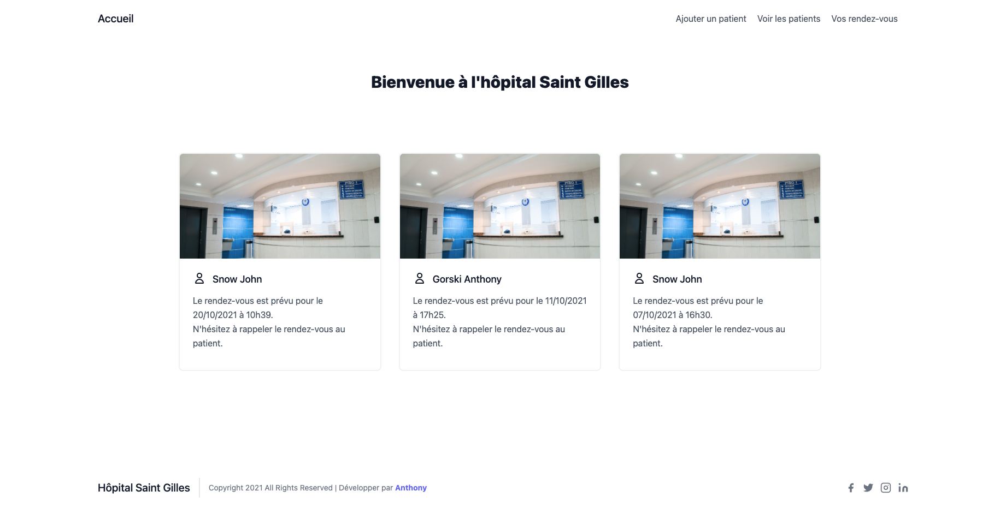

# Hôpital Saint Gilles

> Projet de @LoicPilet pour la manipulation de la POO et la migration vers le MVC

## Homepage 🏠

## Install ⚙️

Pour l'installation, il suffit de créer la bdd avec le code SQL qui se trouve dans le dossier `ressources`.

Ensuite, n'oublions pas de changer les information de la BDD. 

Les informations sont dans le dossier `Librairies/Database.php`.

---

## Author 👤

**Anthony Gorski**

- Website: [agorski.fr](https://www.agorski.fr)
- Youtube : [antho code](https://www.youtube.com/c/AnthoCode)
- Twitter: [@anthony](https://twitter.com/Gorski_Anthony)
- Github: [@anthony](https://github.com/GorskiAnthony)
- LinkedIn: [@anthony](https://linkedin.com/in/anthony-gorski)
